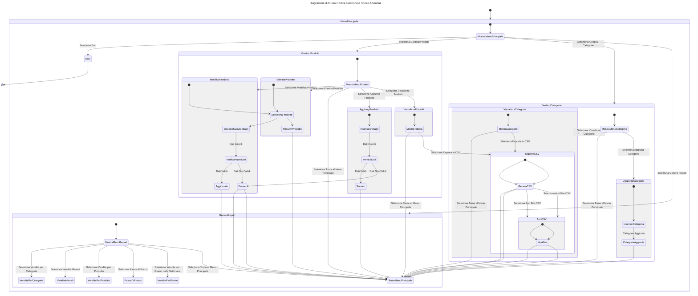

# Gestionale delle Spese Aziendali

## Descrizione

Il **Gestionale delle Spese Aziendali** è un'applicazione console sviluppata in C# progettata per aiutare le aziende a tracciare, gestire e analizzare le spese aziendali. L'applicazione consente di registrare le spese, gestire le categorie e generare report in formato CSV per facilitare l'analisi finanziaria e la contabilità.

## Target

- I **contabili** e i **professionisti della contabilità** sono il target che probabilmente trarrà il massimo vantaggio dal _Gestionale delle Spese Aziendali_ grazie alla sua capacità di gestire e analizzare le spese in modo dettagliato.
- **Manager e Responsabili Finanziari**: Anche se il loro utilizzo potrebbe essere più orientato verso la visualizzazione e l'analisi dei dati piuttosto che la gestione quotidiana. Tuttavia, l'analisi dei report generati dal software sarà comunque utile per loro.

# Funzionalità

Il codice C# definisce un'applicazione completa per la gestione dell'inventario dei prodotti di un'azienda, incluse funzionalità per aggiungere, visualizzare, modificare ed eliminare prodotti, nonché generare vari report. Ecco una ripartizione dei componenti e delle funzionalità chiave:

## Struttura principale:

L'applicazione presenta un menu principale per la gestione dei prodotti, la visualizzazione delle categorie, la generazione di report e l'uscita dal programma.

## Caricamento e salvataggio dei dati:

I prodotti e le categorie vengono caricati da file JSON (GestioneProdotti.json e Categorie.json). L'applicazione supporta la serializzazione e la deserializzazione tramite Newtonsoft.Json.

## Gestione dei prodotti:

- Aggiungi prodotto: consente agli utenti di aggiungere un nuovo prodotto con dettagli quali nome, prezzo, categoria e descrizione. Se viene introdotta una nuova categoria, questa viene aggiunta all'elenco delle categorie.
- Visualizza prodotti: visualizza i prodotti in una tabella, con opzioni di ordinamento quali alfabetico, per data, categoria o prezzo. Gli utenti possono anche esportare l'elenco in CSV.
- Modifica prodotto: consente agli utenti di modificare i dettagli dei prodotti esistenti, inclusi nome, prezzo, categoria e descrizione. Aggiorna anche l'elenco delle categorie se la categoria di un prodotto cambia.
- Elimina prodotto: consente agli utenti di eliminare un prodotto e aggiorna l'elenco delle categorie se necessario.

## Gestione categorie:

- Gli utenti possono visualizzare i prodotti per categoria ed esportare i dati in CSV.

## Report:

- Vendite mensili: calcola le vendite totali per ogni mese.
- Vendite per prodotto: elenca le vendite totali per ogni prodotto.
- Vendite per fascia di prezzo: visualizza le vendite raggruppate per fasce di prezzo predefinite.
- Vendite per giorno della settimana: aggrega i dati di vendita in base al giorno della settimana.

Funzioni di ordinamento e visualizzazione: sono implementate varie funzioni di confronto per ordinare i prodotti in base a diversi criteri come nome, data, categoria e prezzo.

Esportazione CSV: gli utenti possono esportare l'elenco filtrato di prodotti o prodotti categorizzati in un file CSV per uso esterno.

### Gestione Spese

- [x] **Aggiungi Nuove Spese**: Registra nuove spese con dettagli come data, importo, categoria e descrizione.
- [x] **Modifica e Elimina Spese**: Aggiorna o rimuovi spese esistenti.
- [x] **Visualizza Riepilogo**: Consulta un riepilogo dettagliato delle spese registrate.
- [x] **Ordinamento Visualizzazione**: Ordinamento della visualizzazione delle spese registrate in ordine alfabetico, di data, di inserimento, di categoria, di prezzo (alto - basso / basso - alto).

### Categorie di Spesa

- [x] **Gestione Categorie**: Crea e gestisci categorie di spesa personalizzate.
- [x] **Assegna Categorie**: Collega i prodotti alle categorie appropriate per una gestione più organizzata.

### Report e Analisi

- [x] **Vendite per Categoria**: Analizza il totale delle vendite suddiviso per categoria di prodotto. Fornisce una panoramica di quanto ciascuna categoria contribuisce alle vendite complessive.
      Tabella con le categorie e i relativi totali delle vendite.
- [x] **Vendite Mensili**: Analizza il totale delle vendite per mese, offrendo una panoramica delle vendite mensili e aiutando a identificare tendenze stagionali o periodiche.
      Tabella con i mesi e i totali delle vendite per ciascun mese.
- [x] **Vendite per Prodotto**: Analizza il totale delle vendite per ciascun prodotto, permettendo di identificare quali prodotti generano i maggiori ricavi.
      Tabella con i prodotti e i totali delle vendite per ciascun prodotto
- [x] **Fasce di Prezzo**: Analizza le vendite suddivise per fasce di prezzo, fornendo una panoramica su come le vendite si distribuiscono tra diverse fasce di prezzo.
      Tabella con le fasce di prezzo e i totali delle vendite per ciascuna fascia.
- [x] **Giorni della Settimana**: Analizza il totale delle vendite suddiviso per giorno della settimana, utile per comprendere le variazioni delle vendite nei diversi giorni della settimana.
      Tabella con i giorni della settimana e i totali delle vendite per ciascun giorno
- [ ] **Creazione di Grafici**: Analizza le spese attraverso grafici incorporati nel file CSV (in fase di valutazione "Microsoft.Office.Interop.Excel").

### Ricerca del prodotto
- StartWith
- [ ] **Ricerca per Categoria/prodotto/descrizione/data/orario**: analizza e cerca tutti prodotti presenti e fa una ricerca del prodotto tramite classico metodo nel nome e tramite i suoi dettagli specifici

### Funzionalità Future

- [x] **Esporta in CSV**: Genera file CSV contenenti i dettagli delle spese per analisi finanziaria e contabilità.
- [x] **Apertura del File.csv**: Una volta generato ed esportato in file .CSV richiedere all'utente se desidera aprirlo e se si aprire il file appena generato. 2 esportazioni differenti: 1 esporta tutti quanti i prodotti (completi) 2 esporta tutti quanti i prodotti della categoria selezionata.
- [ ] **Gestione degli Utenti**: Implementa registrazione e login degli utenti con ruoli e permessi.
- [ ] **Gestione Spese Carte di Credito Aziendali**: Monitoraggio delle spese effettuate tramite carte di credito aziendali.
- [ ] **Monitoraggio Spese Viaggi e Vitto**: Gestisci le spese relative a viaggi e vitto.
- [ ] **Gestione Spese per Progetti**: Assegna e monitorizza spese specifiche per progetti.
- [ ] **Analisi Finanziaria**: Analisi complessiva del fatturato, utili e perdite.
- [ ] **Budget e Avvisi**: Imposta e monitora budget per categorie con notifiche sui superamenti.
- [ ] **Gestione Multi-Valuta**: Gestisci spese in diverse valute e esegui conversioni tra valute.
- [x] **Persistenza dei Dati**: Implementazione della persistenza dei dati usando JSON e supporto per database.
- [ ] **Recuperare e convertire info file**: Comprendere la conversione del file selezionato in scv che si vuole convertire in informazioni che vadano ad aggiungersi nel file "GesioneProdotti.json"

## Architettura del Progetto

